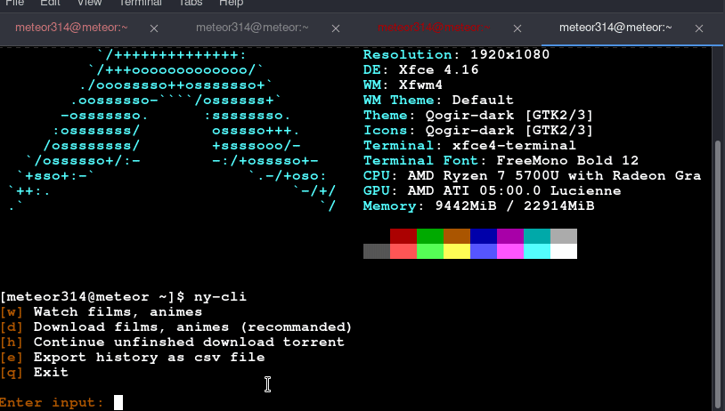

<h1 align="center" > ny-cli</h1>
<p align="center">A  tool which search magnet links and stream it with peerflix from nyaa.si
</p>


### How does this work?
This is a shell script. It scape Nyaa and get the magnet link.
After this it use <b><i>peerlix </i></b> to stream the video from magnet link.
For scraping script use simple gnu utils like sed, awk, paste, cut.

## Requirements

You need <b>NPM</b>. You can follow this tutorial if you don't have node alreday installed.
* [node](https://www.geeksforgeeks.org/installation-of-node-js-on-linux/) - Installation of Node.js on Linux 
* [peerflix](https://github.com/mafintosh/peerflix) - A tool to stream torrent. 
```sh 
sudo npm install peerflix -g
```
You also need to install [mpv](https://mpv.io/). You can install it on Arch
```sh
sudo pacman -S mpv
```
or in debian
```sh
sudo apt-get install mpv
```

## Installation
## Linux
### cURL
cURL **ny-cli** to your **$PATH** and give execute permissions.

```sh
sudo curl -sL "https://raw.githubusercontent.com/meteor314/ny-cli/master/ny-cli" -o /usr/local/bin/ny-cli
sudo chmod +x /usr/local/bin/ny-cli
```
## Windows
You need scoop to install on your.<b><i> [Here]</i> </b>you can find a complete documentation.(https://scoop.sh/)
The easiest way to install it is to open powershell (as a simple user) paste this.

```sh
Set-ExecutionPolicy RemoteSigned -scope CurrentUser
```
```sh
Invoke-Expression (New-Object System.Net.WebClient).DownloadString('https://get.scoop.sh')
```
```sh
scoop bucket add extras
```

```sh
git clone https://github.com/meteor314/ny-cli.git 
```

```sh
cd ny-cli
```

```sh
scoop install ny-cli
```


# How to use ?
Juste write 
```sh
ny-cli 
# ny-cli -h (for options)
```
- To update, just do 
```sh
ny-cli --update
```

- To uninstall, simply remove `ny-cli` from your **$PATH**, for example 
```sh
 sudo rm -f /usr/local/bin/ny-cli
```

## License
This project is licensed under [Apache](https://raw.githubusercontent.com/meteor314/ny-cli/master/LICENSE).

<i>Please read [Disclaimer.md](https://github.com/meteor314/ny-cli/blob/master/Disclaimer.md) before any usage. Happy torrent :) <i>


<br >


